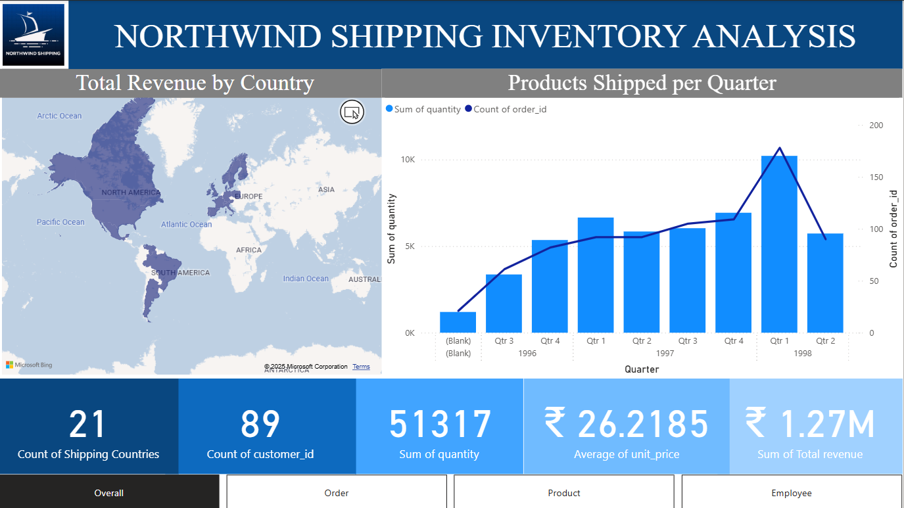
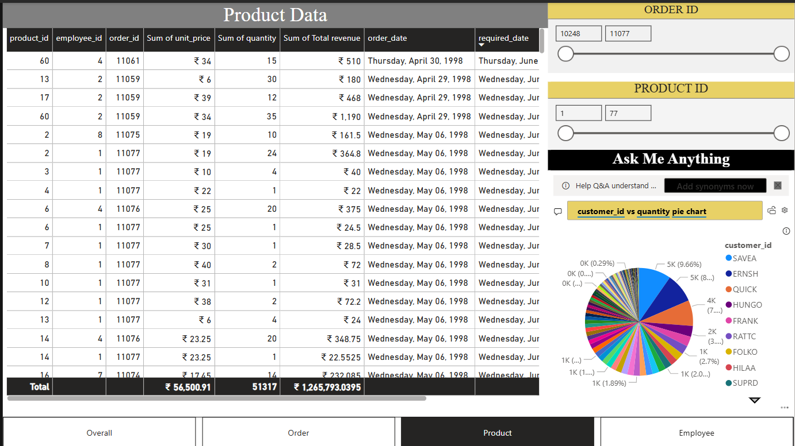

# 📦 Northwind Shipping & Inventory Analysis


## 📊 Project Overview

This project is an interactive **Power BI dashboard** developed to analyze shipping, inventory, product, and order data using the Northwind dataset.

The goal of this project is to transform raw business data into meaningful visual insights that can help understand **shipping performance, inventory levels, product demand, and business trends**.

---

## 🎯 Business Objectives

The dashboard was designed to answer questions such as:

- How are orders and shipments performing?
- Which products have the highest demand?
- What are the current inventory levels?
- Which products may require inventory attention?
- How does shipping activity vary over time?
- Which categories and products contribute most to order activity?
- What trends can be identified from historical data?

---

## 🛠️ Tools & Technologies

- **Microsoft Power BI** – Dashboard development and visualization
- **Power Query** – Data cleaning and transformation
- **DAX** – Calculated measures and KPIs
- **Northwind Dataset** – Business data source
- **GitHub** – Project documentation and portfolio hosting

---

## 📈 Dashboard Preview

### Full Dashboard



### Products Analysis



---

## 🔍 Dashboard Analysis

The dashboard focuses on several areas of business performance.

### 🚚 Shipping Analysis

- Order and shipment activity
- Shipping trends
- Shipper performance
- Shipping patterns over time

### 📦 Inventory Analysis

- Product inventory levels
- Stock availability
- Product-level inventory analysis
- Category-level inventory analysis
- Products requiring inventory attention

### 🛒 Product Analysis

- Product performance
- Product demand
- Category performance
- Order quantities
- Top products by business activity

### 📅 Time Analysis

- Orders over time
- Shipping trends
- Monthly and yearly patterns
- Historical business trends

---

## 🧹 Data Preparation

The data was prepared using **Power Query** before being used in the Power BI data model.

The data preparation process included:

- Cleaning raw data
- Handling missing or inconsistent values
- Transforming columns
- Changing data types
- Preparing tables for analysis
- Establishing relationships between tables

---

## 🧩 Data Modeling

The Power BI data model connects relevant business entities such as:

- Products
- Categories
- Orders
- Order Details
- Customers
- Shippers
- Suppliers

This model allows the dashboard to provide interactive filtering and analysis across different areas of the business.

---

## 🧮 DAX & KPIs

DAX measures were created where required to calculate business metrics and support interactive analysis.

Examples of analytical metrics include:

- Total Orders
- Product Quantity
- Inventory Levels
- Shipping Metrics
- Category Performance
- Product Performance

---

## 💡 Key Insights

The dashboard can be used to identify:

- Products with high and low inventory levels
- Products with higher order activity
- Shipping patterns across different periods
- Differences in activity between shipping providers
- Categories with greater product demand
- Changes in order and inventory activity over time

> **Note:** Insights may change depending on the filters and selections applied within the Power BI dashboard.

---

## 📁 Repository Structure

```text
Assets/
│   ├── Full_dashboard.png
│   └── Products_Page.png
│
Dashboard/
│   └── Northwind Shipping Inventory Analysis.pbix
│
└── README.md
